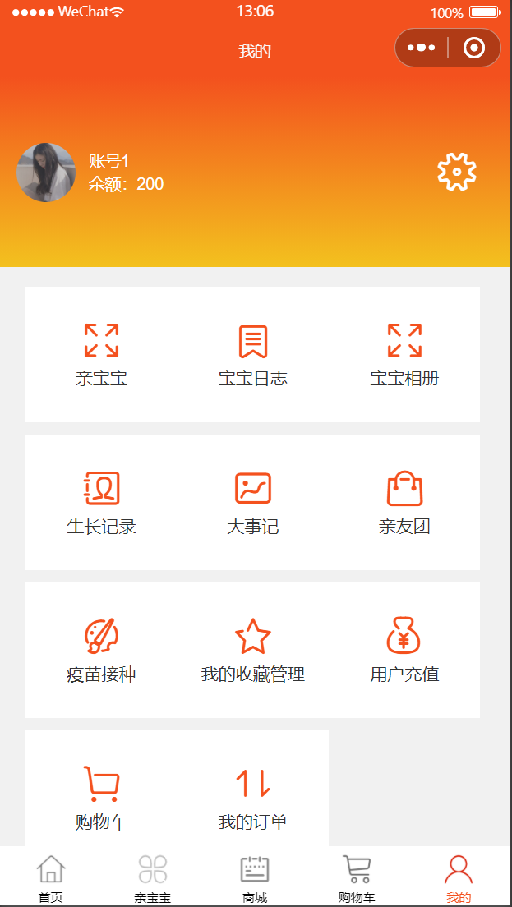
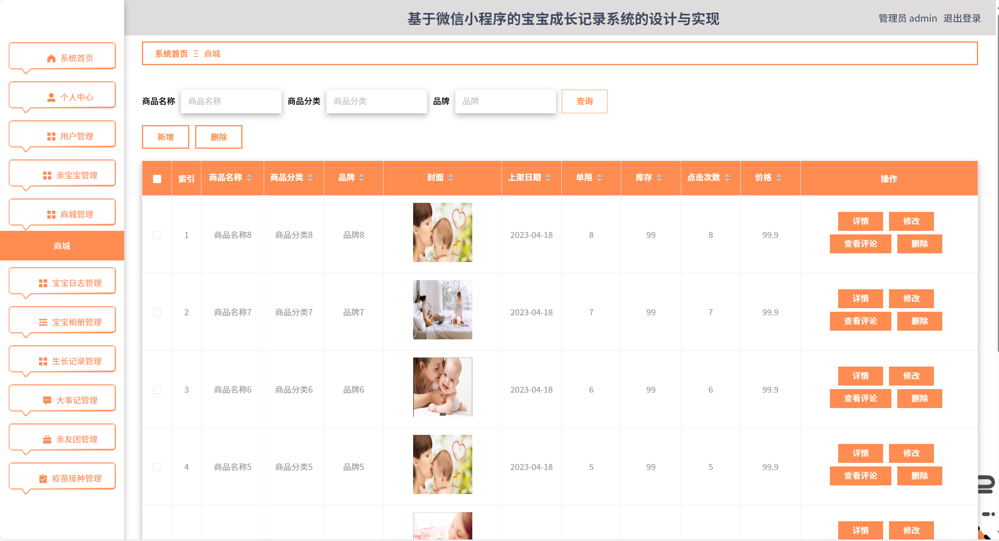
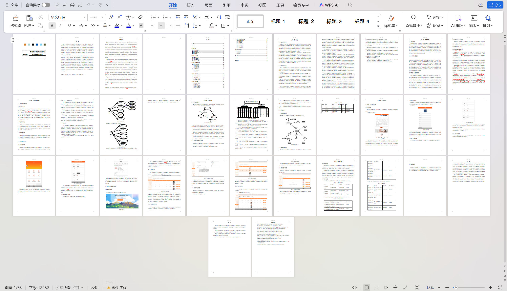

# mpweixinA089
mpweixinA089宝宝成长记录微信小程序+LW
 
## 查看主页获取源码

### 一、关键词
宝宝成长记录小程序，宝宝生活记录小程序，宝宝成长日志小程序

### 二、作品包含
源码+数据库+万字设计文档+全套环境和工具资源+本地部署教程

### 三、项目技术
前端技术：Html、Css、Js、Vue2.0、Element-ui、uniapp
后端技术：Java、SpringBoot2.0、MyBatis

### 四、运行环境（以下版本亲测，其他版本兼容性请自行测试）
开发工具：IDEA/eclipse  + VSCODE + 微信开发者工具+HBuilder X

数据库：MySQL5.7（最低要5.7版本）

数据库管理工具：Navicat10以上版本

环境配置软件： JDK1.8 + Maven3.6.3

前端Nodejs：14

浏览器：谷歌浏览器

### 五、项目介绍
项目编号：mpweixinA089

本系统是选择面向对象的Java语言开发后台，通过微信小程序前台进行设计，使用关系型数据库MySQL存储数据。使用B/S开发方式，用户只需要通过微信访问系统即可获取的宝宝成长记录信息，并可以在线发布亲宝宝等业务，实现了信息的科学管理与查询统计。本文先通过对相关系统的调研，提出开发基于微信小程序的宝宝成长记录系统的意义，然后使用当前主流的技术进行开发，满足基于微信小程序的宝宝成长记录系统的技术要求，分析系统需要实现的功能并进行设计。梳理业务流程，并根据功能设计数据库，最后通过编码实现，介绍实现的关键算法逻辑。在测试阶段通过测试用例来确保系统可以正常运行，并达到前期要求的目的。系统的实施方便了的宝宝成长记录管理，将信息化技术完美的应用在基于微信小程序的宝宝成长记录系统中，使得的宝宝成长记录变得快捷高效。

  

### 六、运行截图

